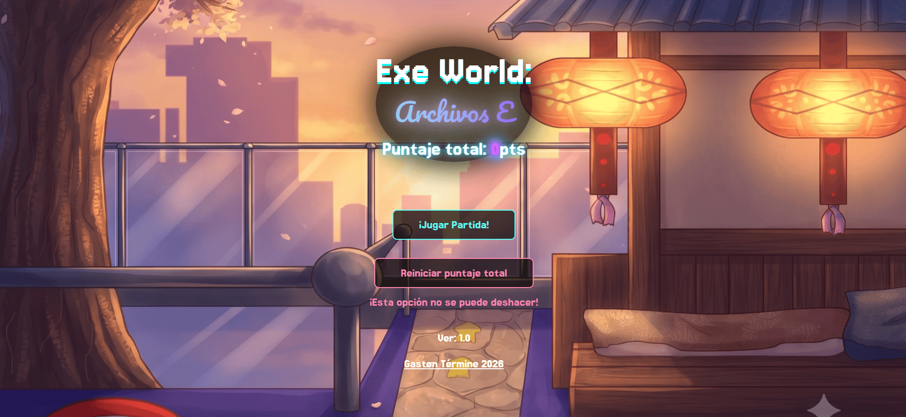
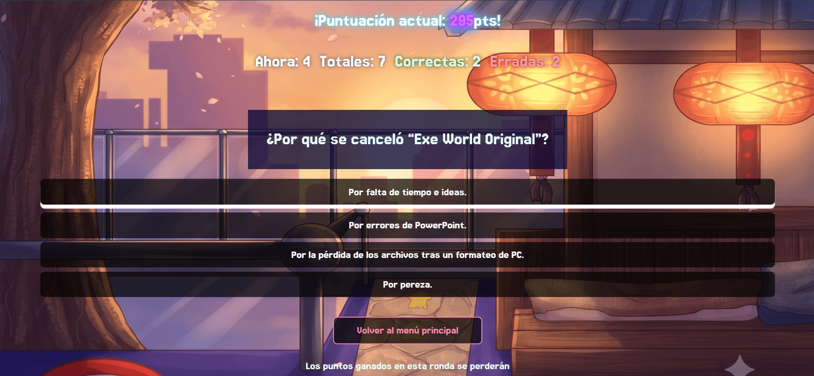
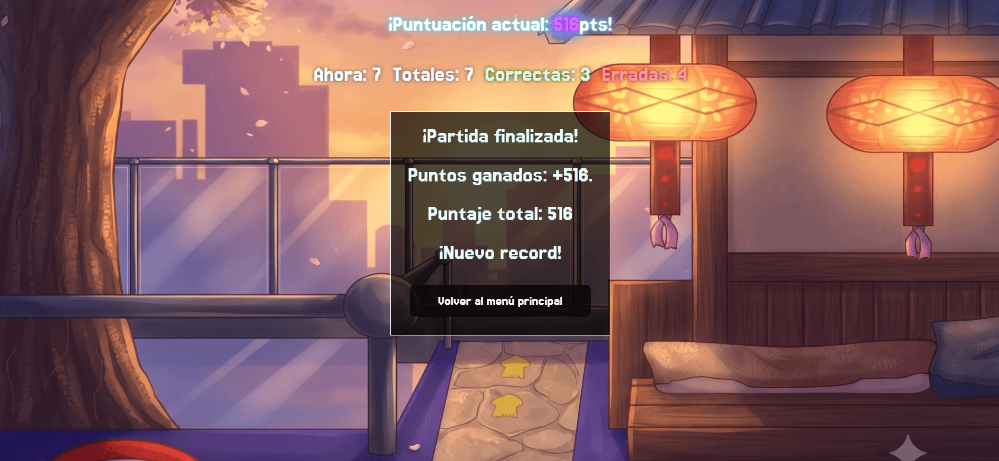

# Exe World: Archivos E

Este proyecto es una aplicación web interactiva de tipo trivia o cuestionario (Quiz). Fue desarrollado principalmente como una práctica intensiva para dominar el manejo de estados (`useState`), el ciclo de vida y flujos de efectos (`useEffect`), y la persistencia de datos en el navegador utilizando `localStorage`.

## Descripción del Proyecto

**Exe World: Archivos E** permite a los usuarios jugar partidas de preguntas y respuestas, acumulando puntos tanto en la partida actual como en un puntaje global histórico. El juego está diseñado para no perder el progreso si el usuario cierra o recarga la página, gracias a la sincronización constante del estado de React con el almacenamiento local del navegador. Permite iniciar nuevas partidas, responder preguntas con retroalimentación inmediata, abandonar la partida perdiendo el progreso actual, y reiniciar el puntaje global.

**Link**: 


## Características Principales

* **Persistencia de Datos (Local Storage):** El juego guarda automáticamente el progreso de la partida actual (`gameData`) y el puntaje acumulado (`overallScore`). Si el usuario recarga la página, retoma exactamente donde lo dejó.
* **Gestión de Estados Complejos:** Manejo de objetos anidados para controlar el historial de la partida (preguntas correctas, incorrectas, pregunta actual y totales) y filtrado de arrays para avanzar a la siguiente pregunta.
* **Retroalimentación Inmediata:** Al responder, el sistema evalúa si la respuesta es correcta o incorrecta, muestra los puntos ganados y revela una aclaración sobre la respuesta antes de avanzar.
* **Cálculo de Récords:** Evalúa el puntaje al finalizar la partida para notificar al usuario si ha roto su récord personal de puntuación.
* **Abandono de Partida:** Opción para salir al menú principal antes de terminar, lo que resetea el progreso de la ronda actual sin afectar el puntaje histórico.
* **Reinicio Global:** Un botón de "peligro" que permite formatear por completo el puntaje total del jugador.

## Stack Tecnológico

* **Librería Principal:** React 18+
* **Lenguaje:** TypeScript (Tipado estricto mediante `interfaces` para las props y la estructura de datos).
* **Hooks Utilizados:**
* `useState` (con inicialización perezosa para leer el LocalStorage).
* `useEffect` (para sincronizar los cambios de estado con la memoria del navegador).


* **Estilos:** CSS Modules (`MainMenu.module.css`) y clases globales (`boton-retro`, `center-all`).


## Estructura de Datos (Ficha Técnica)

El núcleo de la lógica de la aplicación se basa en un tipado estricto definido en TypeScript para garantizar la consistencia de los datos y el estado del juego.

### Constantes y Tipos

```typescript
export const NUMBER_OF_QUESTIONS = 7;

// Tipado estricto para las opciones de respuesta permitidas
export type Answers = 'A' | 'B' | 'C' | 'D';

```

### Interfaces de Datos

**`Question`**
Define la estructura de cada pregunta individual que se renderiza en la aplicación.

```typescript
export interface Question {
    question: string;
    options: {
        'A': string,
        'B': string,
        'C': string,
        'D': string
    },
    correct_answer: Answers,
    clarification: string
}

```

**`GameHistory`**
Lleva el registro estadístico de la partida en curso.

```typescript
export interface GameHistory {
    totalQuestions: number,
    correctQuestions: number,
    wrongQuestions: number,
    currentQuestion: number
}

```

**`GameData`**
Representa el estado global de la sesión actual de juego, almacenando los puntos, el historial y las preguntas restantes.

```typescript
export interface GameData {
    scoreInGame: number,
    gameHistory: GameHistory | null,
    questions: Question[];
}

```

### Local Storage Keys

* `gameData`: Almacena el objeto serializado de la partida en curso (basado en la interfaz `GameData`).
* `overallScore`: Almacena un número entero con los puntos totales acumulados históricamente.

## Mapa del Sitio (Component Tree)

La estructura de componentes fluye de manera condicional dependiendo de si hay una partida en progreso o no:

```text
App (Punto de entrada y Gestor de Estados Globales)
 │
 ├── MainMenu (Pantalla de inicio, puntaje total, inicio/reinicio)
 │
 └── GameInProgress (Contenedor de la partida activa y estadísticas)
      │
      └── QuizList (Lógica de preguntas, evaluación de respuestas y renderizado)
           │
           └── EndGame (Pantalla de fin de juego, cálculo de récord y guardado final)

```


## Pantalla de inicio


## Partida activa


## Fin del juego
